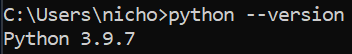

# MSA 2022 Python Workshop

Welcome to the Python Workshop! By now, you should be familiar with Jupyter notebooks and writing basic Python code. If you're new to the language then don't worry, this workshop is primarily designed for you to consolidate some of the skills you've acquired from Microsoft Learn.

This workshop is also meant to get you thinking about how to solve problems and maybe even doing a little Internet searching on using data structures and file manipulation, which will be useful for all three phases of MSA.

To complete this workshop, it's recommended to use a Jupyter notebook as well as a virtual environment so that you don't interfere with other Python versions you might have on your system.

Pre-requisites:
- Complete the [Python for beginners - Microsoft Learn Path](https://docs.microsoft.com/en-us/learn/paths/beginner-python/)
- Download [Visual Studio Code](https://code.visualstudio.com/)
- Python installed on your system as described in the [Get started with Python in Visual Studio](https://docs.microsoft.com/en-us/learn/modules/python-install-vscode/) module

🛑 Please ensure that you have Python 3 installed on your system! The easiest way to check this would be to open your Command Prompt/Terminal and type `python --version`. You should see something like this (for this workshop, don't worry about the numbers after the 3):



💡This workshop should take roughly 20-30 minutes, but in case you get stuck, there are answers provided for each exercise (they progressively get a bit more difficult but regardless, no peeking). Note that these answers are just one way out of an almost infinite number of ways to solve any programming exercise, so don't worry if your answers are different or if you take longer to complete them!

## Introduction

The year is 2496. 

You're an astronaut on a space station in the Alpha Centauri star system located 4.1 x 10<sup>13</sup> kilometres from the Earth (or in other words, a **really** long way away from home). 

You're conducting astrobiological experiments in search of extraterrestrial life and generally minding your own business while listening to lo-fi hip-hop (yes, it's still a thing even in the 25th century) when suddenly, you receive unexpected transmissions of unknown origin.

Unfortunately, your advanced systems can only decode these transmissions into a file format known as comma-separated value files (more commonly referred to by 21st century millennials as CSV files) and none of your systems can decipher what's in them.

Fortunately, your years of training at the Microsoft Space Academy had a course on Python (in case you ever needed to use one of the *ancient languages*). Use this knowledge to explore the transmission file and uncover the hidden message.

## Exercise 1

Your first task, like almost anything involving unfamiliar data, is to see what it actually looks like and get it into a more usable form for further analysis. 

**Investigate the transmission file provided by opening the file and inserting each line of the file into a list for later use, then printing it.**
> Hint: Here's one way to [open CSV files](https://docs.python.org/3/library/csv.html#:~:text=A%20short%20usage%20example)

<details>
<summary>Exercise 1 Answer</summary>

```python
from pprint import pprint # for printing data structures in a prettier way

transmissions = []
with open("transmissions.csv") as file:
    for line in file:
        line = line.strip()
        transmissions.append(line.split(","))
pprint(transmissions)
```

</details>

## Exercise 2

After investigating the transmission file, you notice that each row contains an *id* and a corresponding sequence of characters, and that the *transmission* column is garbled and contains non-integer characters like "." and "-".

You ask your senior colleague on the space station if they've come across anything like this before, and they suggest that in order to uncover more information, you should **take the sum of all integers in each row of the *transmission* column while ignoring non-integer characters**.

Before they start reminiscing with you about the great battle between the C-Sharpians and Typescripters (which you've heard countless times already), you go back to your system and start figuring out a way to do what they suggested while also **storing these sums to use later**.

> Hint: Go back through the [MS Learn error handling module](https://docs.microsoft.com/en-us/learn/modules/python-error-handling/) and try to catch something

<details>
<summary>Exercise 2 Answer</summary>

```python
transmissions.pop(0)
ids = [row[0] for row in transmissions]
transmissions = [row[1] for row in transmissions]
sums = []
for t in transmissions:
    current_sum = 0
    for char in t:
        try:
            current_sum += int(char)
        except:
            continue
    sums.append(current_sum)
print(sums)
```

</details>

## Exercise 3
With a little help from your notes on **ASCII characters** during your time at the Academy), you realise that the **sums you calculated** might need to be **converted into something more readable** by humans like yourself.

Furthermore, your colleague floats by and mentions that **each number in the *ids* column** might indicate the order in which these sums need to be arranged (**from smallest id to largest id**).

You thank them for their help and huddle yourself into your cabin with your system, isolating yourself from the rest of the universe (akin to the ways of your developer ancestors from the 2000s). It's just you now, working to uncover the hidden message that might shape the course of humanity forever...

> Hint: [This function](https://docs.python.org/3/library/functions.html?highlight=#chr) might help

<details>
<summary>Exercise 3 Answer</summary>

```python
freq_dict = {int(ids[i]):sums[i] for i in range(len(ids))}
freq_tuples = sorted(freq_dict.items())
message = ""
for item in freq_tuples:
    message += chr(item[1])
print(message)
```

</details>