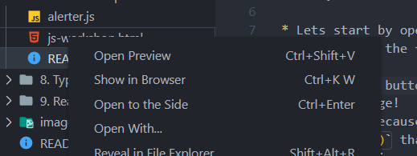

# MSA 2022 JS Workshop

Welcome to the MSA JS workshop! This workshop will help you implement some basic JS scripting for a webpage.

JS is a programming language that is used to create dynamic content on a webpage. It can be used to alter page elements, send alerts, call other code, etc.

* Lets start by opening `js-workshop.html` in your browser (double-click the file and select the browser of your choice when prompted)

  * Click the button labelled `Click Me!` - you should get an alert message!
  * This is because in `alerter.js`, there is a function called `sendAlert()` that is being called when the button is clicked!
  * The function sends an alert, which shows up as a popup on your browser when it is triggered
  * The function is referenced in `js-workshop.html` because within the html head, there is a `` tag containing a reference to the `alerter.js` file.
* Now let's make this page a little bit more interesting:
    - [ ] Let's make the `sendAlert` function also show the General Kenobi GIF that is on the page.
      - [ ] Start by referencing the id element within the html by using `document.getElementById()` so that you have access to the HTML element in JS
      - [ ] Set the hidden attribute on the document to false so that the image becomes visible when the function is called
      - [ ] Edit the HTML so that hidden is true by default 