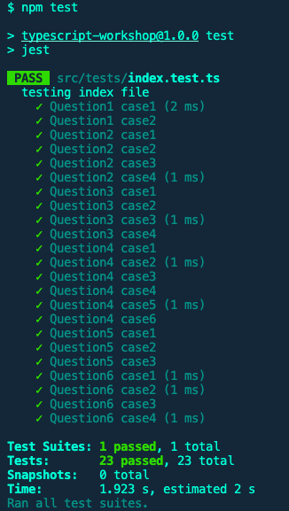

# Typescript Workshop

Welcome to the Typescript Workshop! 

TypeScript, as its name suggests, is a typed superset of JavaScript, which means that all JavaScript code is valid in TypeScript – making it very easy to get started. In addition, TypeScript has several language features including static typing, most ES6 syntax, and object-oriented programming constructs. It is a compiled language, which means you’ll have to transpile it to JavaScript before it can be run, but the benefits are well worth it.

If you haven't already, please complete [TypeScript Microsoft Learn](https://docs.microsoft.com/en-us/learn/paths/build-javascript-applications-typescript/) before attempting this workshop. (You only need to complete the **FIRST 4 MODULES** of the workshop for this assignment.)

## Pre-requisites:

A working knowledge of JavaScript, object-oriented programming, and the command line is assumed. The only prerequisites are a [Text Editor](https://code.visualstudio.com/)(VS code) and npm, the[Node.js](https://nodejs.org/) package manager.

If you do not have npm installed, install the appropriate [Node.js](https://nodejs.org/) runtime for your operating system. Node.js is a JavaScript runtime outside the browser (for use in servers, etc), and npm is a package manager for various JavaScript packages and command line tools.

Alternatively, you can test out [Typescript](https://www.typescriptlang.org/) by using the TypeScript online playground.

After you have installed all the required dependencies above, you can install typescript by running the following command in the command line:

```bash
$ npm install -g typescript
```

Once the above step is completed, the TypeScript compiler `tsc` will be available as a command line tool. We’ll demonstrate how to use later in this workshop.


## Assignment

### Installation
Before you start this assignment, please install all the required dependencies by running the following command in the command line:

```bash
$ npm install
```

### Folder Structure

```bash
.
├── dist                    # Compiled javascript files
├── src                     # Source files 
     ├── index.ts           # Main entry point
│    └── tests              # Automated tests
├── jest.config.js          # Jest configuration
├── tsconfig.json           # TypeScript configuration
├── package.json            # Project configuration
└── README.md
```

**For this assignment, you will only be working in the `index.ts` file. Please do not modify any other files.**

> **Hint**: You can check the test cases in the `tests/index.test.ts` file if you are unsure about the detail of some questions.

### Exercise 1:
Create a function called `sumTwoNumbers` that takes two numbers and returns the sum of the two numbers. The function only accepts numbers as parameters and returns a number.

### Exercise 2:
Create a enum type called `HairColor` with the following values:
- black
- blonde
- brown
- red

### Exercise 3:
Construct a class called `Person` with the following properties:
- `name`: string
- `age`: number

> **Hint**: You should have a constructor that takes two parameters. You also need to include getters and setters for the properties.

### Exercise 4:
Create a class called `Student` that extends the `Person` class. The `Student` class should have the following additional properties:
- `hairColor`: HairColor (enum)

> **Hint**: You should also have a constructor that takes three parameters and make sure getters and setters are used for the additional properties.

### Exercise 5:
Create a Interface called `PersonInterface` that has the following properties:
- `name`: string
- `age`: number

The parameter `age` could be optional.

### Exercise 6:
Create a Generic function called `sortAndConcat` that takes two arrays of any type and returns a new array with the elements sorted and concatenated. The function should return a new array. **Notice: You should also remove any duplicate elements from the new array.**

> **Hint**: You can use `<T>` to specify the type of the generic parameter.

## Submission

Once you have completed the assignment, you can run the tests by running the following command in the command line:

```bash
$ npm test
```

If the tests pass, that means you have completed the assignment correctly :) You can refer to the images below to see what the correct output looks like.



## Extras
If you would like too see the compiled output of the TypeScript compiler, you can run the following command in the command line:

```bash
$ tsc
```

The compiler will generate JavaScript files in the `dist` folder.
