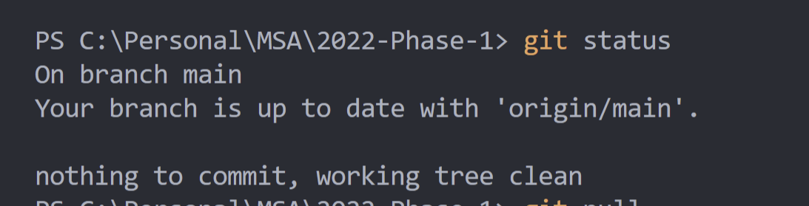

# MSA 2022 Github Workshop

Welcome to the Git Workshop! If you haven't already, please complete [this](https://docs.microsoft.com/en-us/learn/modules/introduction-to-github/) Microsoft Learn module before attempting this workshop.

## Basic Git Commands - Git CLI

Just to help out with the understanding of how Git works, we will be doing some work with the Git CLI to get you familiar with interacting with GitHub via the command line on your PC.

If you haven't already, please download the Git-SCM [here](https://git-scm.com/)

Now we are going to run through some basic git commands:

1. Navigate to your desktop in file explorer and open up a terminal window (command prompt)
2. Call `git clone https://github.com/NZMSA/2022-Phase-1.git`. This will clone the MSA Phase 1 repository to your local machine.
3. Now you will want to run `cd 2022-Phase-1`. This will change your working directory to the repository that you just cloned.
4. Call `git status`. This will show you the status of your local repository, which is a copy of the MSA Phase 1 repository on GitHub. It should look something like this:

4. Now let's call `git checkout -b feature/checklist-changes`. This will create a new branch called **feature/checklist-changes** on your local machine.
   1. Nothing will have looked like it has changed - let's make a change now.
   2. Navigate to the directory in file explorer, and open up `README.md`. This is the readme file that's displayed on GitHub!
   3. At the bottom of the file, add this line to the end of the file - `-[X] Completed GitHub Workshop`.
5. Now let's take a look at how our branch is looking.
   1. Call `git status`.
   2. You should notice some text saying that a file has been changed!
6. Now let's add a file to a commit. This is like saying that a file is going to be a part of the commit (kind of like picking and choosing what we want to save).
   1. We only have one altered file, so let's go ahead and call `git add .`
   2. This tells git that we want to add all files in the directory, which includes the file we just changed.
7. Call `git status` once again. You will notice that the file has been added to the commit, and is considered _staged_.
   1. If we think a file shouldn't be part of our next save for some reason, or shouldn't be included in Git (like binary files, for example, or secret values) we can call `git reset FILE_NAME`.
   2. Try this now - call `git reset README.md`.
   3. Now try calling `git status` again - you'll notice that the README file is now no longer staged, and is considered uncommitted.
   4. Please try staging the README.md file again.
8. Let's now create a new commit.
   1. Call `git commit -m "SOME MESSAGE"`.
   2. Call `git status`.
   3. You will notice that there are no longer any staged or unstaged changes.
   4. We can verify that our commit went through by calling `git log`.
   5. You will see that your commit message is on the top of the log!
   6. Press 'q' to quit of the log explorer.
9. Now let's go back to our main branch
   1. Call `git checkout main`
   2. Now take a look at the README.md - you'll notice that your change isn't there!
   3. This is because our change is on a different branch!!!
10. Let's now put our changes from our feature branch onto our main branch.
    1. Call `git merge feature/checklist-changes`.
    2. You'll notice that the README.md file has now been updated on the main branch!
11. Now let's try pushing these changes up to GitHub!
    1. Call `git push`.
    2. You'll notice that git has produced an error - it's warned you that you aren't authorized!
    3. This is because you do not have the permissions to alter the remote repository - GitHub will protect your code base from users who aren't allowed access from changing your code :)

## Assignment

Go through the git command documentation - which you can find [here](https://git-scm.com/doc) to help accomplish the following task:

Remove the current **remote** that your local repository is connected to (Which belongs to MSA) and replace it with a remote that you own. Then push your changes to that new remote.

You will want to start [here](https://git-scm.com/docs/git-remote) for the command documentation, and you will want to go [here](https://stackoverflow.com/questions/2432764/how-to-change-the-uri-url-for-a-remote-git-repository) for an example of how to do it. Good luck!
