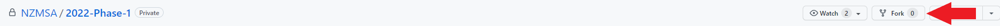

# :fire: MSA Phase 1 2022 :fire:

## :tada: :sparkles: Welcome students to Phase 1 :sparkles: :tada:

Welcome to the first phase of the Microsoft Student Accelerator for 2022!

This repository contains all the necessary material to complete Phase 1 of the program.

Please refer to this README for guidance. If you are unsure of anything please reach out in our Discord channel and one of our handy-dandy MSP's are more than happy to help you out :simple_smile:

---

## Phase 1 Requirements :pencil:

**To pass Phase 1, students are required to complete / obtain 34,000 XP on your Microsoft Learn Account.**

Sign up for Microsoft (MS) Learn [here](https://docs.microsoft.com/en-us/learn/) and start accumulating points by completing the modules! Pick and choose modules which resonate with you or follow our recommended modules below!

---

## Recommended Modules :mortar_board:

There are a plethora of modules within MS Learn ranging from incredibly difficult to things that might not necessarily be useful in your particular field of interest. We've decided to help you out and have hand-picked a list of modules that we (MSP's) think will be very useful for you in your career in tech and moving onto the next phase in the MSA program.

### Developer tools

- [x] [Git](https://docs.microsoft.com/en-us/learn/modules/introduction-to-github/) is a Version Control System (VCS) which is useful for collaborating with others, but also acts as a save system for developers to checkpoint their own progress (and to re-load from bad decisions and their consequences).

### Programming Languages

- [ ] [Python](https://docs.microsoft.com/en-us/learn/paths/beginner-python/) is an incredibly useful scripting language used widely in the data science community, but is also useful for creating small pieces of supportive code
- [ ] [C#](https://docs.microsoft.com/en-us/learn/paths/csharp-first-steps/) is a programming language created by Microsoft and is used in a wide range of industry applications from front-end web applications to back-end APIs. Often combined with [.NET](https://dotnet.microsoft.com/en-us/learn/dotnet/what-is-dotnet) which is an open source developer platform, created by Microsoft, for building many different types of applications.

### Web Development

- [ ] [HTML & CSS](https://docs.microsoft.com/en-us/learn/modules/build-simple-website/) are the backbone of any web-page. Knowing what these are and how they are structured is fundamental for doing any web development work.
- [ ] [JavaScript](https://docs.microsoft.com/en-us/learn/paths/web-development-101/) is the fundamental language for running code on the browser. This is what is leveraged (usually) to create rich and seamless user interfaces and experiences on the web.
- [ ] [TypeScript](https://docs.microsoft.com/en-us/learn/paths/build-javascript-applications-typescript/) is an open-source language by Microsoft which builds upon the original syntax of JavaScript. It provides features such as static type definitions, classes and interfaces which makes it easier for developers to resolve issues, as your application becomes larger. **NOTE** - **ONLY THE FIRST 4 MODULES ARE ESPECIALLY USEFUL** - The remaining content is more advanced, and is unlikely to come up in our use-case for TS starting out. If you feel like you need additional knowledge, go ahead and finish this learning path - we're not going to stop you :smile:
- [ ] [React](https://docs.microsoft.com/en-us/learn/paths/react/) is a highly versatile view engine used to combine HTML, CSS and JS into one cohesive block (known as _components_). This makes web development much more streamlined and efficient when making changes to the UI. **NOTE** - **IGNORE THIS [PAGE](https://docs.microsoft.com/en-us/learn/modules/react-states-events/4-events)**

### APIs

- [ ] [RESTful APIs](https://docs.microsoft.com/en-us/learn/modules/build-web-api-minimal-api/) are an implementation of API for accessing information and providing a service without needing to implement a UI. These are useful as they allow developers to perform operations that are quite complex without developing the solution themselves, thus saving time.

### Databases

- [ ] [Relational Databases](https://docs.microsoft.com/en-us/learn/modules/explore-relational-data-offerings/) are a way to represent stored data. This can be used in combination with an API to create, read, update or delete entries in the database. For example, if you have a website where users are prompted to sign up with user credentials, that user's sign up information will likely be stored using a Relational Database.

### AI/Machine Learning

- [ ] [AI and Machine Learning](https://docs.microsoft.com/en-us/learn/paths/get-started-with-artificial-intelligence-on-azure/) are complex topics, and are hard to wrap your head around without a lot of pre-requisite knowledge. To help dip your toes in, we've linked in a module for helping explain the basics at a high-level.

---

## Recommended Schedule :books:

That's a LOT of modules - and we're sure that a lot of you are probably feeling quite overwhelmed right now (we definitely were when we did this).

To help you out, we've created a schedule which will allow you to complete all of the recommended modules and also meet the requirements to pass Phase 1!

We have also created small modular workshops for each section of MS Learn. **These workshops intended for you to solidify your understanding and are optional. To pass Phase 1 all you will have to do is obtain 34,000 MS learn XP on your account.**

### Checklist :white_check_mark:

- [ ] Week 1 (15 APR - 21 APR)
  - [x] [Git](https://docs.microsoft.com/en-us/learn/modules/introduction-to-github/)
  - [ ] [1. Git Workshop](https://github.com/NZMSA/2022-Phase-1/tree/main/1.%20Git%20workshop)
  - [ ] [AI and Machine Learning](https://docs.microsoft.com/en-us/learn/paths/get-started-with-artificial-intelligence-on-azure/)
- [ ] Week 2 (22 APR - 28 APR)
  - [ ] First half of [Python](https://docs.microsoft.com/en-us/learn/paths/beginner-python/) (that's the first **6** modules)
- [ ] Week 3 (29 APR - 5 MAY)
  - [ ] Second half of [Python](https://docs.microsoft.com/en-us/learn/paths/beginner-python/) (that's the second **6** modules)
  - [ ] [2. Python Workshop](https://github.com/NZMSA/2022-Phase-1/tree/main/2.%20Python%20workshop)
- [ ] Week 4 (6 MAY - 12 MAY)
  - [ ] [RESTful APIs](https://docs.microsoft.com/en-us/learn/modules/build-web-api-minimal-api/)
  - [ ] [3. RESTful-API workshop](https://github.com/NZMSA/2022-Phase-1/tree/main/3.%20RESTful-API%20workshop)
  - [ ] [Relational Databases](https://docs.microsoft.com/en-us/learn/modules/explore-relational-data-offerings/)
  - [ ] [4. Relational DB workshop](https://github.com/NZMSA/2022-Phase-1/tree/main/4.%20Relational%20DB%20workshop)
- [ ] Week 5 (13 MAY - 19 MAY)
  - [ ] First half of [C#](https://docs.microsoft.com/en-us/learn/paths/csharp-first-steps/) (that's the first **4** modules)
- [ ] Week 6 (20 MAY - 26 MAY)
  - [ ] Second half of [C#](https://docs.microsoft.com/en-us/learn/paths/csharp-first-steps/) (that's the second **4** modules)
  - [ ] [5. C# workshop](https://github.com/NZMSA/2022-Phase-1/tree/main/5.%20C%23%20workshop)
- [ ] Week 7 (27 MAY - 2 JUN)
  - [ ] [HTML & CSS](https://docs.microsoft.com/en-us/learn/modules/build-simple-website/)
  - [ ] [6. HTML & CSS workshop](https://github.com/NZMSA/2022-Phase-1/tree/main/6.%20HTML%2BCSS%20workshop)
- [ ] Week 8 (3 JUN - 9 JUN)
  - [ ] [JavaScript](https://docs.microsoft.com/en-us/learn/paths/web-development-101/)
  - [ ] [7. JavaScript workshop](https://github.com/NZMSA/2022-Phase-1/tree/main/7.%20JS%20workshop)
- [ ] Week 9 (10 JUN - 16 JUN)
  - [ ] [TypeScript](https://docs.microsoft.com/en-us/learn/paths/build-javascript-applications-typescript/)
  - [ ] [8. TypeScript workshop](https://github.com/NZMSA/2022-Phase-1/tree/main/8.%20Typescript%20workshop)
- [ ] Week 10 (17 JUN - 23 JUN)
  - [ ] [React](https://docs.microsoft.com/en-us/learn/paths/react/)
  - [ ] [9. React workshop](./9.%20React%20workshop/)
- [ ] Spend the next 4 days relaxing - you're done!!!

---

## Recommended Tools

As you go through and do these modules, you'll find that you need quite a few tools to complete some of the workshops as well as the modules. To help facilitate this process of trying to get everything downloaded, we've compiled a list here:

- [ ] Required Tools
  - [ ] [Node.JS](https://nodejs.org/en/)
  - [ ] [Git](https://git-scm.com/)
  - [ ] [Python](https://www.python.org/downloads/)
  - [ ] [React](https://reactjs.org/docs/create-a-new-react-app.html)
  - [ ] [.NET](https://dotnet.microsoft.com/en-us/download)
- [ ] Development Environments
  - [ ] [VS Code](https://code.visualstudio.com/) a lightweight IDE suitable for developing any language, with a bit of fine-tuning (I'd recommend googling on how to set it up for use)
  - [ ] [JetBrains Rider](https://www.jetbrains.com/rider/) is an alternative IDE to Visual Studio (and, IMO, runs about a million times faster)
    - [ ] [Free License](https://www.jetbrains.com/community/education/#students) for students
  - [ ] [Visual Studio](https://visualstudio.microsoft.com/vs/community/) the c# IDE
  - [ ] [Fork](https://git-fork.com/) is meant to be paid, but it doesn't lock you out of anything if your trial expires so **shhhh**. Makes managing and visualising git much easier

---

## Hot Tips

- Managing your time well is always good - it's enough content that trying to do it all in one week is going to be a struggle!
- Forking this repository is a good idea:
  - You can do that by clicking the fork button on this site in the upper right corner (see below)

- This is useful, because it will allow you to fill in the checklists on this page!

* [ ] This is an empty checklist item
  - [x] This is a completed checklist item! you can complete checklist items by opening up this README file in edit mode, and putting an **X** character between the open square brackets.
